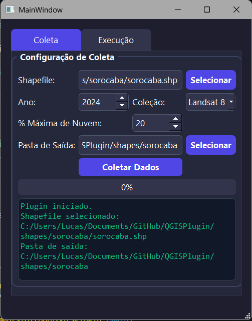
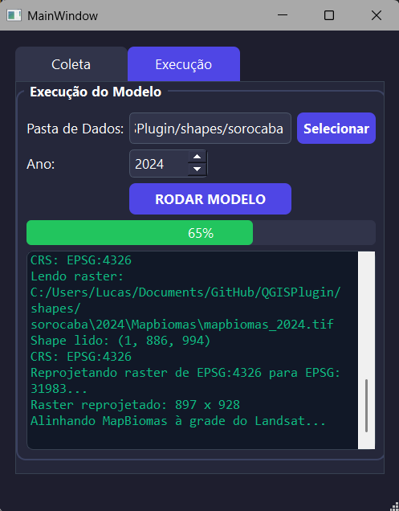
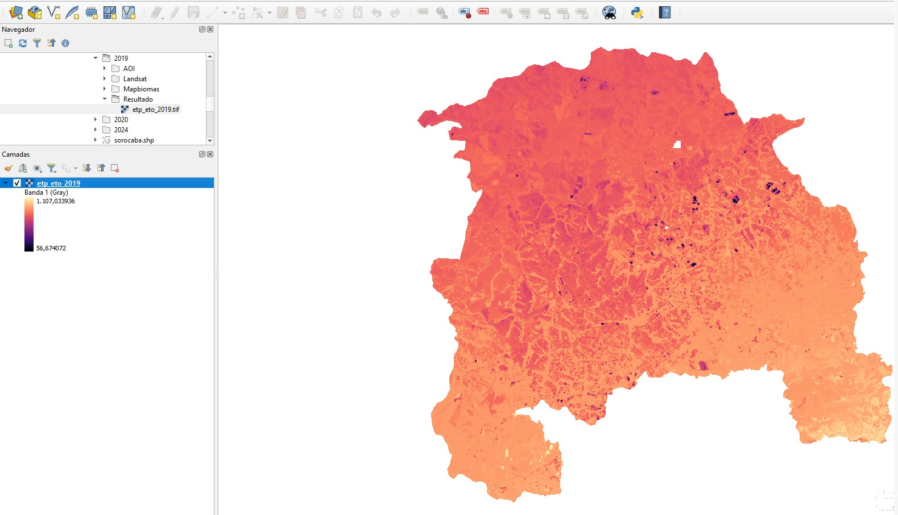

# QGISPlugin_TesteApp — Estimativa de ET com RNA

Aplicação simples em **Python + PyQt5** para testar a coleta de dados via Google Earth Engine e a geração de um raster de evapotranspiração anual (`ET`) usando uma Rede Neural Artificial.

Para rodar:

```bash
python test_app.py
```

---

## 1. O que este projeto faz?

A ferramenta possui duas etapas:

1. **Coleta**: baixa dados Landsat e MapBiomas para uma área escolhida pelo usuário.
2. **Execução**: aplica o modelo RNA e gera um raster GeoTIFF com a estimativa de evapotranspiração anual.

A saída principal é um arquivo como:

```text
2024/Resultado/etp_eto_2024.tif
```

O modelo está prevendo a variável **ET anual estimada**, em `mm/ano`.

---

## 2. Estrutura da pasta

```text
QGISPlugin_TesteApp/
├── test_app.py                  # Arquivo principal para abrir a interface
├── run_app.bat                  # Atalho opcional para Windows
├── main_dialog.py               # Controle da interface
├── coleta_gee.py                # Coleta Landsat/MapBiomas no Earth Engine
├── executar_modelo.py           # Executa a RNA e gera o raster final
├── requirements.txt             # Lista de dependências Python
│
├── ui/
│   ├── __init__.py
│   ├── ui_rna_mpl.py            # Interface convertida para Python
│   └── rna_mpl.ui               # Interface original do Qt Designer
│
├── modelo/
│   ├── modelo_etp.h5            # Modelo RNA treinado
│   ├── scaler_X.pkl             # Normalizador das entradas
│   ├── scaler_y.pkl             # Normalizador da saída
│   └── feature_columns.json     # Ordem correta das 25 features
│
├── shapes/
|   └── sorocaba                 # Shape de exemplo
|       ├── sorocaba.cpg            
│       ├── sorocaba.dbf             
│       ├── sorocaba.prj
|       ├── sorocaba.qmd
|       ├── sorocaba.shp              
│       └── sorocaba.shx 
|
└── docs/
    └── images/                  # Imagens do README
```

---

## 3. Instalação recomendada

No Windows, recomenda-se usar Conda para evitar problemas com bibliotecas geoespaciais.

```bash
conda create -n rna_qgis python=3.11 -y
conda activate rna_qgis

conda install -c conda-forge geopandas rasterio shapely pyproj fiona gdal numpy pandas -y

pip install earthengine-api geemap PyQt5 tensorflow scikit-learn joblib
```

Teste se as dependências foram instaladas:

```bash
python -c "import ee, geemap, geopandas, rasterio, tensorflow, sklearn, joblib, PyQt5; print('Tudo OK')"
```

---

## 4. Autenticação do Google Earth Engine

Na primeira execução, talvez seja necessário autenticar:

```bash
earthengine authenticate
```

O projeto usa o identificador de projeto configurado dentro de `coleta_gee.py`:

```python
EE_PROJECT = "qgis-493503"
```

Se for usar outro projeto do Google Earth Engine, altere esse valor no arquivo `coleta_gee.py`.

---

## 5. Como rodar

Entre na pasta do projeto limpo:

```bash
cd caminho/para/QGISPlugin
```

Ative o ambiente:

```bash
conda activate rna_qgis
```

Rode:

```bash
python test_app.py
```

No Windows, também é possível abrir pelo arquivo:

```text
run_app.bat
```

---

## 6. Como usar a interface

## 6.1. Aba Coleta

Na aba **Coleta**, selecione:

- o shapefile da área de interesse;
- o ano;
- a coleção Landsat;
- a porcentagem máxima de nuvem;
- a pasta de saída.



O shapefile deve ser uma área/polígono. Evite usar shapefile de ruas, linhas ou pontos.

Exemplo de arquivos necessários do shapefile:

```text
sorocaba.shp
sorocaba.shx
sorocaba.dbf
sorocaba.prj
```

Depois da coleta, a pasta de saída ficará assim:

```text
pasta_saida/
└── 2024/
    ├── AOI/
    │   └── aoi.shp
    ├── Landsat/
    │   ├── landsat_2024.tif
    │   └── landsat_2024_metadata.json
    └── Mapbiomas/
        └── mapbiomas_2024.tif
```

---

## 6.2. O que significa “nuvem máxima”?

A porcentagem de nuvem é um filtro das imagens Landsat.

Exemplo:

```text
Nuvem máxima = 30%
```

significa que o programa usará apenas cenas Landsat com menos de 30% de cobertura de nuvem.

Valores recomendados:

| Valor | Indicação |
|---|---|
| 10% | Mais rigoroso, pode encontrar poucas imagens. |
| 20% | Boa qualidade, mas ainda restritivo. |
| 30% | Padrão recomendado. |
| 40% | Mais flexível. |
| 50% ou mais | Usar se não encontrar imagens suficientes. |

---

## 6.3. Aba Execução

Depois da coleta, vá para a aba **Execução**.

Selecione a pasta raiz onde os dados foram salvos, por exemplo:

```text
caminho/para/QGISPlugin/shapes/sorocaba
```

Não selecione diretamente a pasta `2024`; selecione a pasta que contém a pasta `2024`.



Clique em **Rodar Modelo**.

O resultado será salvo em:

```text
2024/Resultado/etp_eto_2024.tif
```

---

## 7. O que o modelo usa como entrada?

O modelo usa 25 variáveis por pixel:

```text
b2, b3, b4, b5, b6, b7,
precip, Ano, X, Y,
uso_3.0, uso_9.0, uso_11.0, uso_12.0, uso_15.0,
uso_20.0, uso_21.0, uso_24.0, uso_25.0, uso_29.0,
uso_33.0, uso_39.0, uso_41.0, uso_46.0, uso_48.0
```

A ordem dessas variáveis está em:

```text
modelo/feature_columns.json
```

Não altere esse arquivo sem retreinar ou validar o modelo.

---

## 8. O que o raster final significa?

Cada pixel do raster final representa uma estimativa de **evapotranspiração anual** em `mm/ano`.

Exemplo:

```text
Valor do pixel = 850
```

significa:

```text
ET anual estimada naquele local = 850 mm/ano
```

---

## 9. Visualização no QGIS

Para visualizar melhor o raster final:

1. Abra o `.tif` no QGIS.
2. Clique com botão direito na camada.
3. Vá em **Propriedades > Simbologia**.
4. Escolha **Banda simples falsa-cor**.
5. Clique em carregar valores mínimo/máximo.
6. Escolha uma rampa de cor.



Interpretação visual:

```text
valores menores → menor ET
valores maiores → maior ET
```

---

## 10. Problemas comuns

## Erro: `No module named PyQt5`

Instale:

```bash
pip install PyQt5
```

ou ative o ambiente correto:

```bash
conda activate rna_qgis
```

## Erro no Earth Engine

Tente autenticar novamente:

```bash
earthengine authenticate --revoke
earthengine authenticate
```

## Erro: nenhuma imagem Landsat encontrada

Aumente o limite de nuvem, por exemplo de `20%` para `40%`.

## Raster com valores muito estranhos

Possíveis causas:

- raster Landsat antigo gerado antes da correção de escala;
- precipitação fallback pouco representativa;
- área muito diferente da região usada no treinamento;
- shapefile inválido ou com CRS incorreto.

Refaça a coleta usando o `coleta_gee.py` atual.

---

## 11. Observações importantes

- O modelo atual usa coordenadas `X` e `Y`; por isso, ele pode funcionar melhor em regiões parecidas com a região usada no treinamento.
- A precipitação ainda é usada como valor anual de referência caso não seja informada manualmente.
- O pós-processamento remove valores fisicamente impossíveis, como ET negativa.
- Para resultados científicos mais robustos, recomenda-se usar precipitação real e validar a saída com dados independentes.

---

